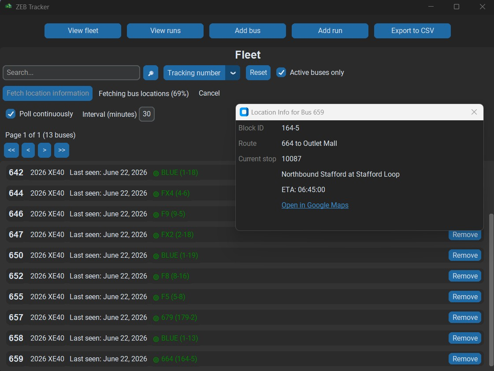
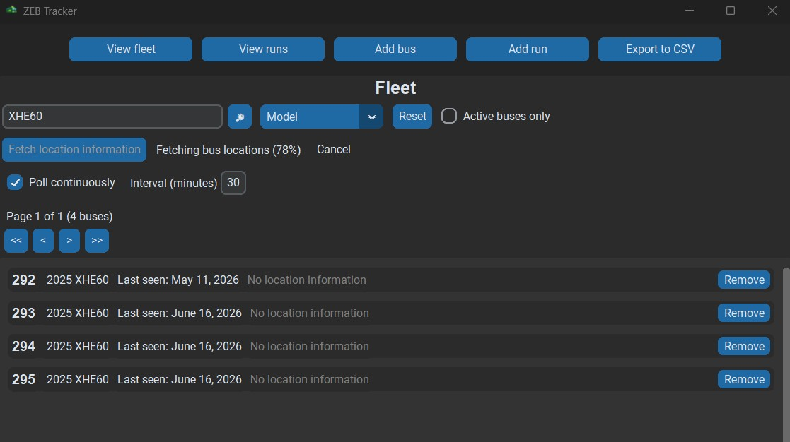
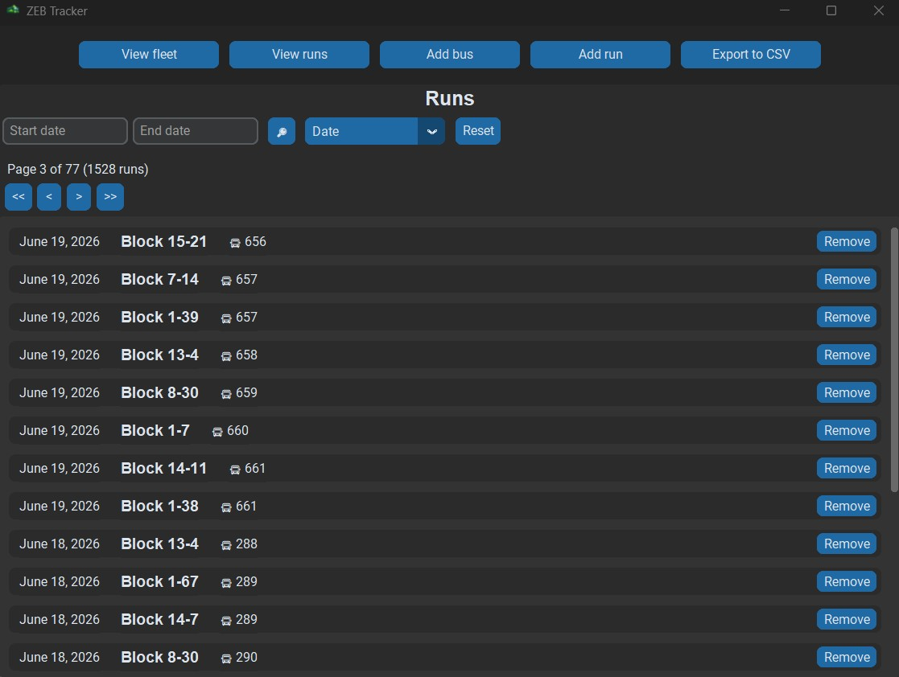
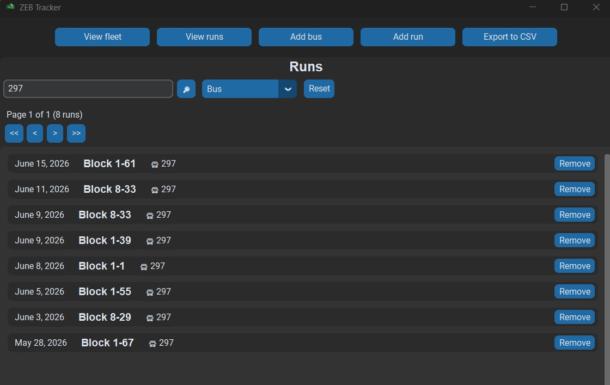
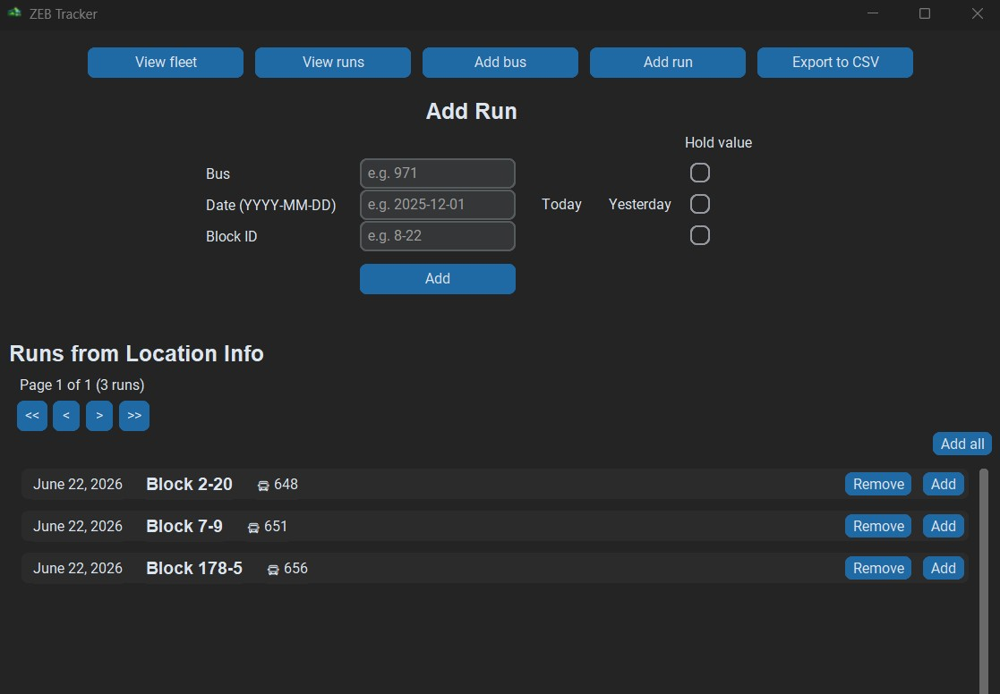

# Zero-Emission Bus Tracker

This project was created to track Winnipeg's ZEB rollout, which I have been
closely following since the fall of 2025. At first, I was recording each ZEB run 
in a spreadsheet which automatically aggregated the data by bus and generated
cool statistics and graphs. However, as the rollout gained traction in the spring
of 2026, manually entering each run in a spreadsheet became very time-consuming.

I started building this Python program in order to automate
my bus-tracking habit. It includes a live traker that uses the Winnipeg
Transit API and GTFS archive to find all active ZEB runs, after which they can
all be added to the database in a few clicks. From there, you can view and 
search/filter all runs and buses in the system, and export the run data to
a CSV file.

As for the technical side, the app uses an MCV architecture with listeners in
the domain model, SQLite persistence, and a Custom Tkinter GUI. It also makes
use of concurrency for the location scan (via Python's threading module).

I've always been fascinated by Python's elegance and wanted to get more comfortable
with the language as I rarely encountered it in my coursework. This was the perfect
opportunity to do so, all while building something meaningful and useful for
myself.

---

## Usage

### Prerequisites

- Python 3.13+
- Winnipeg Transit API Key

### Installations

1. From the command line, navigate to the directory in which you would like to
clone the project and type the following:
```bash
git clone https://github.com/Michel-Prejet/zeb-tracker
```
2. Install the required dependencies from the command line as follows:
```bash
cd zeb-tracker/src
python -m pip install -r requirements.txt
```

3. Add your Winnipeg Transit API key to the environment.
    * Create a file named `.env` in the project root directory, beside `requirements.txt`.
    * Add your API key using the following format:
    ```bash
   API_KEY=your_api_key_here
    ```

### Running

From the project root directory, type the following to start the program:
```bash
python main.py
```
---

## Features

- Add Winnipeg Transit buses to the fleet by entering their unique tracking number, 
year, and model (e.g. Bus 298 is a 2025 XE60).
- Manually add runs completed by buses in the fleet. Each run stores the date it
was completed and the ID of the block to which the bus was assigned (e.g. Bus 298
was assigned to block 1-7 on July 1st, 2026).
- View all buses in the fleet (sorted by increasing tracking number) along with
the date each bus was last dispatched (according to the run inventory).
  * Navigate to the next/previous page, or the first/last page in the fleet
    inventory.
- Search the fleet by the tracking number, year, or model of the buses.
  * Searches return partial matches (e.g. when searching by tracking number,
  entering "2" will return all buses whose tracking number contains that digit).
- Get location information from the Winnipeg Transit API for any active buses in
the fleet by running a location scan.
  * Run the location scan once (regular mode) or periodically (polling mode). 
  * Once location information is up to date, filter buses in the fleet by whether 
  they are currently active.
  * Click on a bus's location information to open a pop-up with more details,
  including the full route and destination names, the block ID, the current 
  stop ID, name, and ETA, and a link to open that stop in Google Maps.
  * View a list of runs automatically inferred from the location scan, and
  add them to the run inventory.
- View all runs in the database (sorted by decreasing date).
  * Navigate to the next/previous page, or the first/last page in the run
  inventory.
- Search the run inventory by date, block ID, or the bus's tracking number or
model.
  * Searches return partial matches (e.g. when searching by tracking number,
    entering "2" will return all runs whose bus's tracking number contains that 
    digit). The only exception is when searching by block ID, in which case only
    exact matches are returned.
- Export run data to a CSV file in a custom directory.
  * Export all runs in the database, or only those starting from a given date.

---

## Screenshots





---

## Technologies

- App built with Python 3.13.3 in IntelliJ IDEA
- GUI built with Custom Tkinter library
- SQLite3 2.6.0 database

---

## License

All code is licensed under the MIT license.

---

## Author

Michel Préjet

Computer Science Student, University of Manitoba

*Last updated: August 2nd, 2026*