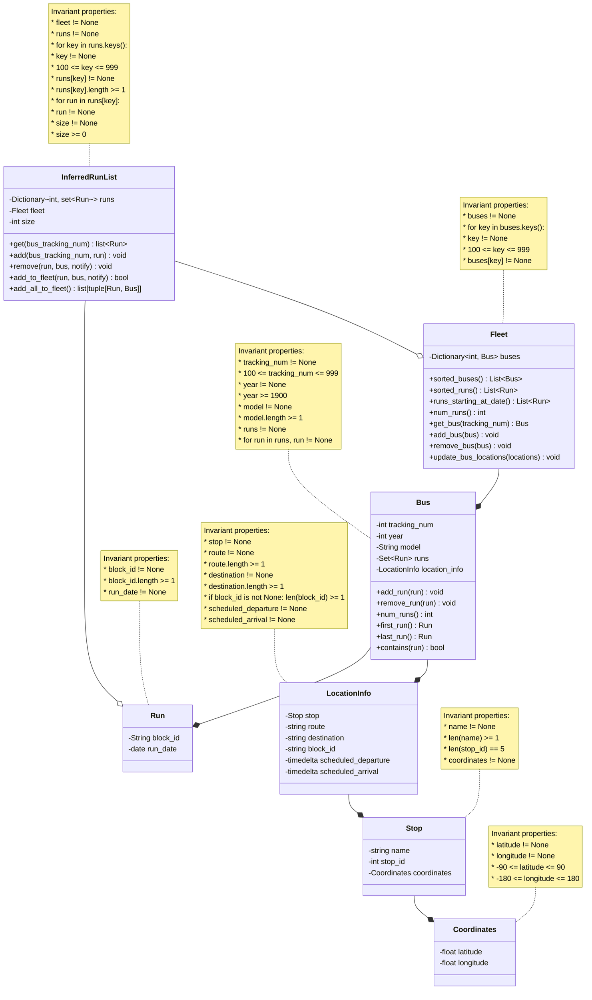

# Domain Model

The following is a class diagram for the ZEB tracker application.

```mermaid
classDiagram
    class Fleet {
        -Dictionary~int, Bus~ buses
        
        +sorted_buses() List~Bus~
        +sorted_runs() List~Run~
        +runs_starting_at_date() List~Run~
        +num_runs() int
        +get_bus(tracking_num) Bus
        +add_bus(bus) void
        +remove_bus(bus) void
        +update_bus_locations(locations) void
    }
    
    note for Fleet"Invariant properties:
    * buses != None
    * for key in buses.keys(): 
    *   key != None
    *   100 <= key <= 999
    *   buses[key] != None
    "
    
    Fleet --* Bus
    
    class Bus {
        -int tracking_num
        -int year
        -String model
        -Set~Run~ runs
        -LocationInfo location_info
        
        +add_run(run) void
        +remove_run(run) void
        +num_runs() int
        +first_run() Run
        +last_run() Run
        +contains(run) bool
    }

    note for Bus "Invariant properties:
    * tracking_num != None
    * 100 <= tracking_num <= 999
    * year != None
    * year >= 1900
    * model != None
    * model.length >= 1
    * runs != None
    * for run in runs, run != None
    "
    
    Bus --* Run
    
    class InferredRunList {
        -Dictionary~int, set~Run~~ runs
        -Fleet fleet
        -int size
        
        +get(bus_tracking_num) list~Run~
        +add(bus_tracking_num, run) void
        +remove(run, bus, notify) void
        +add_to_fleet(run, bus, notify) bool
        +add_all_to_fleet() list[tuple[Run, Bus]]
    }
    
    note for InferredRunList"Invariant properties:
    * fleet != None
    * runs != None
    * for key in runs.keys():
    *   key != None
    *   100 <= key <= 999
    *   runs[key] != None
    *   runs[key].length >= 1
    *   for run in runs[key]:
    *       run != None
    * size != None
    * size >= 0
    "
    
    InferredRunList --o Run
    InferredRunList --o Fleet
    
    class Run {
        -String block_id
        -date run_date
    }
    
    note for Run"Invariant properties:
    * block_id != None
    * block_id.length >= 1
    * run_date != None
    "
    
    class LocationInfo {
        -Stop stop
        -string route
        -string destination
        -string block_id
        -timedelta scheduled_departure
        -timedelta scheduled_arrival
    }
    
    Bus --* LocationInfo
    
    note for LocationInfo"Invariant properties:
    * stop != None
    * route != None
    * route.length >= 1
    * destination != None
    * destination.length >= 1
    * if block_id is not None: len(block_id) >= 1
    * scheduled_departure != None
    * scheduled_arrival != None
    "
    
    class Stop {
        -string name
        -int stop_id
        -Coordinates coordinates
    }
    
    LocationInfo --* Stop
    
    note for Stop"Invariant properties:
    * name != None
    * len(name) >= 1
    * len(stop_id) == 5
    * coordinates != None    
    "
    
    class Coordinates {
        -float latitude
        -float longitude
    }
    
    Stop --* Coordinates
    
    note for Coordinates"Invariant properties:
    * latitude != None
    * longitude != None
    * -90 <= latitude <= 90
    * -180 <= longitude <= 180
    "
```