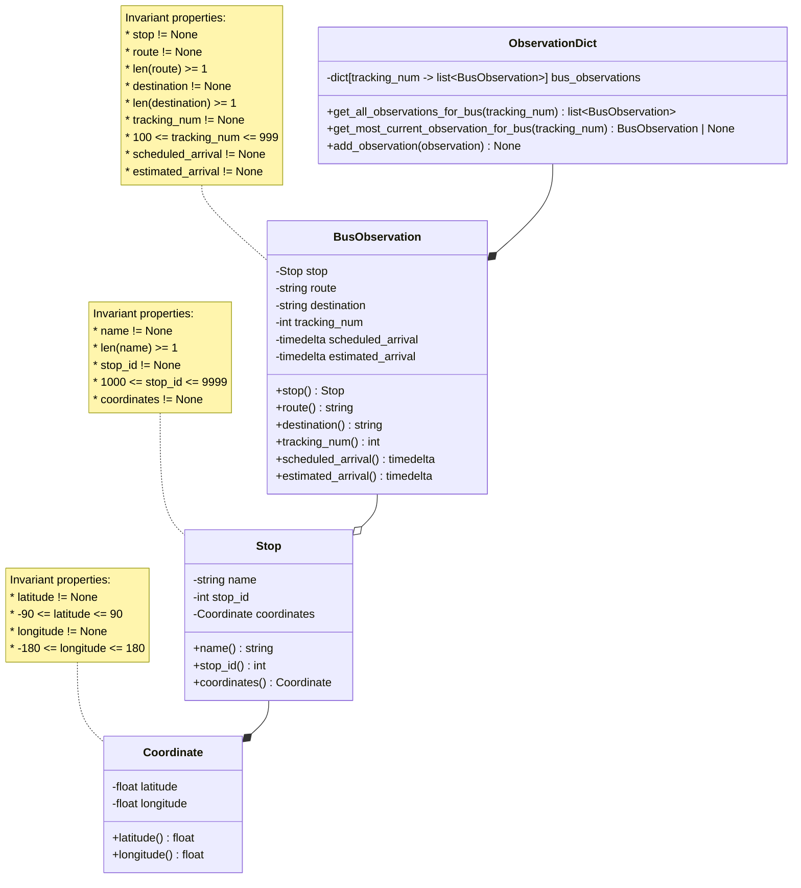

```mermaid
classDiagram
    class ObservationDict {
        %% Observations sorted by estimated arrival time
        -dict[tracking_num -> list~BusObservation~] bus_observations
        
        +get_all_observations_for_bus(tracking_num) list~BusObservation~
        +get_most_current_observation_for_bus(tracking_num) BusObservation | None
        +add_observation(observation) None
    }

    ObservationDict --* BusObservation
    
    class BusObservation {
        -Stop stop
        -string route
        -string destination
        -int tracking_num
        -timedelta scheduled_arrival
        -timedelta estimated_arrival

        +stop() Stop
        +route() string
        +destination() string
        +tracking_num() int
        +scheduled_arrival() timedelta
        +estimated_arrival() timedelta
    }
    
    BusObservation --o Stop
    
    note for BusObservation"Invariant properties:
    * stop != None
    * route != None
    * len(route) >= 1
    * destination != None
    * len(destination) >= 1
    * tracking_num != None
    * 100 <= tracking_num <= 999
    * scheduled_arrival != None
    * estimated_arrival != None
    "
    
    class Stop {
        -string name
        -int stop_id
        -Coordinate coordinates
        
        +name() string
        +stop_id() int
        +coordinates() Coordinate
    }
    
    Stop --* Coordinate

    note for Stop"Invariant properties:
    * name != None
    * len(name) >= 1
    * stop_id != None
    * 1000 <= stop_id <= 9999
    * coordinates != None
    "
    
    class Coordinate {
        -float latitude
        -float longitude
        
        +latitude() float
        +longitude() float
    }
    
    note for Coordinate"Invariant properties:
    * latitude != None
    * -90 <= latitude <= 90
    * longitude != None
    * -180 <= longitude <= 180
    "
```